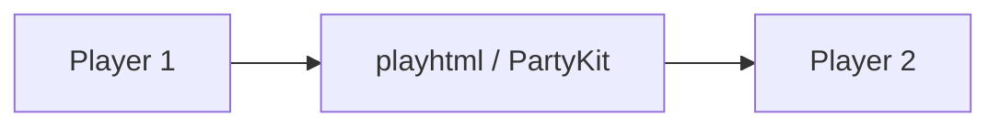
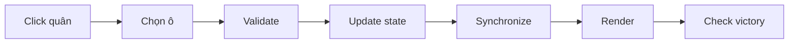

# OTTv2 — Oẳn Tù Tì Online

Game chiến thuật hai người trên bàn 9×9, dùng TypeScript, Vite, Vitest và playhtml. Đây là bài tập lập trình mạng với một phòng chung qua hạ tầng đồng bộ của playhtml.

## Chạy trên Ubuntu

Cần Node.js 20.19+ và npm. Chạy `npm install`, `npm run dev`; mở URL Vite hiển thị (thường là `http://localhost:5173`). Không mở trực tiếp `dist/index.html` bằng `file://`; thư mục `dist` cần được phục vụ qua HTTP/HTTPS. `npm run test`, `npm run typecheck`, `npm run build` dùng để kiểm tra. Vite chỉ phục vụ frontend; trạng thái thời gian thực được playhtml đồng bộ qua hạ tầng PartyKit theo [tài liệu chính thức](https://playhtml.fun/docs/).

## Luật

Mỗi bên có 3 ✊, 3 ✋, 3 ✌️. Player 1 ở a2:c4, Player 2 ở g6:i8. Đi đúng một ô theo tám hướng; ✊ ăn ✌️, ✌️ ăn ✋, ✋ ăn ✊. Cùng loại chặn nhau. Loại hết một loại quân đối phương hoặc tới i9 (Player 1), a1 (Player 2) để thắng. Không còn nước đi là hòa. Trận đầu Player 1 đi trước; chơi lại đổi người đi trước.

## Phòng và multiplayer

Nhập tên và vào phòng chung; gửi cùng đường link cho người thứ hai. Người thứ ba vào xem. Hai người nhấn Sẵn sàng để bắt đầu. Refresh giữ danh tính playhtml để vào lại vị trí. Presence hiển thị kết nối và tạm ngưng nước đi nếu thiếu người. Muốn kiểm tra thủ công, mở hai browser profile khác nhau; kiểm tra vào phòng chung, lượt, ăn quân, kết quả, refresh, mất kết nối và chơi lại. Các trường hợp này chưa được đánh dấu đã kiểm thử nếu chưa thực hiện thực tế.

## Kiến trúc và triển khai

`src/game/engine.ts` chứa luật thuần; `src/multiplayer/room.ts` quản lý phòng, shared state và presence; `src/main.ts` hiển thị UI. Ứng dụng dùng một playhtml room cố định và một page data cho trận đấu. Build bằng `npm run build`, đưa thư mục `dist/` lên Vercel hoặc Netlify với fallback mọi đường dẫn về `index.html`.

## Hạn chế

playhtml là đồng bộ giữa các client, không xác nhận transaction hoặc quyền điều khiển trên server. Kiểm tra luật và phiên bản lượt hiện ở client; các cập nhật đồng thời hay client bị sửa có thể gây sai lệch. Danh tính playhtml không phải xác thực chống giả mạo tuyệt đối. Để chống gian lận và giải quyết xung đột chắc chắn cần một server authoritative xử lý lệnh và lưu state, còn playhtml tiếp tục phục vụ presence hoặc hiển thị. Hai vị trí chơi được giữ cho người đã vào đầu tiên; người mới sẽ là khán giả nếu cả hai vị trí đã có người, kể cả khi một người đang offline.
