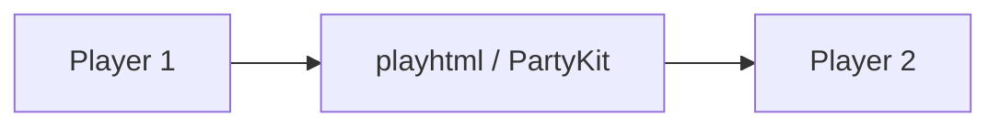
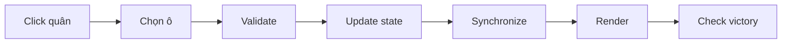

# OTTv2 — Oẳn Tù Tì Online

Game chiến thuật hai người trên bàn 9×9, viết bằng TypeScript, Vite, Vitest và playhtml.

## Chạy trên Ubuntu

Cần Node.js 20.19+ và npm:

```bash
npm install
npm run dev
```

Mở địa chỉ Vite in trong Terminal (thường là `http://localhost:5173`). Để chơi trên hai máy cùng mạng, **cả hai máy mở cùng địa chỉ Network** do Vite in ra, ví dụ `http://192.168.1.20:5173`; không dùng `localhost` trên một máy và IP trên máy kia. Không mở trực tiếp `dist/index.html` qua `file://`.

Kiểm tra bằng `npm run typecheck`, `npm run test`, `npm run build`. Vite chỉ phục vụ frontend; playhtml đồng bộ dữ liệu qua hạ tầng PartyKit theo [tài liệu chính thức](https://playhtml.fun/docs/).

## Phòng chơi

Trang chủ hiển thị danh sách phòng đang có. Nhập tên, chọn **Tạo phòng mới** để nhận mã ngẫu nhiên; chia sẻ mã hoặc link cho người thứ hai. Có thể nhập mã hay bấm **Vào phòng** từ danh sách. Hai người nhấn **Tôi đã sẵn sàng** để bắt đầu. Người thứ ba chỉ xem.

Mỗi phòng có kênh game riêng trong playhtml; danh sách phòng dùng một kênh chung. Khi trận đã kết thúc và số người chơi đang online giảm xuống dưới hai, phòng bị xóa khỏi danh sách và không thể tham gia bằng mã cũ. Nếu tất cả đóng tab, phòng sẽ được dọn khi có người khác mở trang. Nút **Rời phòng** giải phóng vị trí ngay. Dữ liệu kênh game cũ có thể vẫn còn trong hạ tầng playhtml; mã phòng đã xóa không còn trỏ tới kênh đó.

Mỗi lần chạy `npm run dev` dùng một phiên lobby mới; các máy phải dùng cùng một Vite server để nhìn thấy cùng danh sách. Bản production dùng phiên được tạo lúc `npm run build`.

## Luật

Mỗi bên có 3 ✊, 3 ✋, 3 ✌️. Player 1 ở a2:c4, Player 2 ở g6:i8. Đi đúng một ô theo tám hướng; ✊ ăn ✌️, ✌️ ăn ✋, ✋ ăn ✊. Cùng loại chặn nhau. Loại hết một loại quân đối phương hoặc tới i9 (Player 1), a1 (Player 2) để thắng. Không còn nước đi là hòa. Trận đầu Player 1 đi trước; chơi lại đổi người đi trước.





## Kiến trúc và triển khai

`src/game/engine.ts` chứa luật thuần; `src/multiplayer/room.ts` quản lý danh sách phòng, kênh game và presence; `src/main.ts` hiển thị UI. Build bằng `npm run build`, đưa `dist/` lên Vercel hoặc Netlify. Muốn chơi qua Internet, cả hai dùng cùng URL HTTPS sau khi triển khai.

## Kiểm thử multiplayer

Mở hai browser profile hoặc hai máy cùng địa chỉ Network. Tạo phòng, tham gia bằng mã, kiểm tra danh sách, trạng thái sẵn sàng, lượt, ăn quân, kết quả, chơi lại và rời phòng. Sau khi một người rời trận đã kết thúc, kiểm tra phòng biến mất và mã cũ không tham gia được. Những bước thủ công này chưa được đánh dấu đã kiểm thử nếu chưa chạy trên thiết bị thật.

## Hạn chế

playhtml không cung cấp transaction hay quyền điều khiển game trên server. Luật và phiên bản lượt được kiểm tra ở client, nên client bị sửa hoặc thao tác đồng thời vẫn có thể gây sai lệch. Presence có thể báo offline trễ. Để chống gian lận và bảo đảm xử lý đồng thời, hướng phát triển là bổ sung server authoritative. Danh sách và các kênh game dùng chung một kết nối playhtml, nên chưa phù hợp với số lượng phòng rất lớn.
